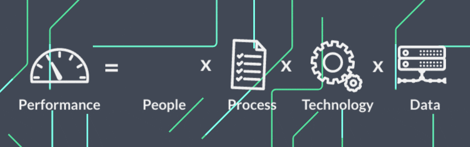

### Bonjour et bienvenue sur mon profil GitHub ! 👋
###  

Je suis un développeur full-stack junior (spring boot / angular) passionné par le développement logiciel, avec une spécialisation en Java et Angular. Curieux et motivé, je m'intéresse également à des domaines émergents tels que l'intelligence artificielle et les systèmes embarqués. J'apprécie la collaboration avec d'autres développeurs et je crois fermement au partage des connaissances. N'hésitez pas à explorer mes projets et à me contacter pour toute collaboration ou discussion sur le développement logiciel.

# Technologies :

 
<strong>Languages :</strong>
  
 
 

 

 
<strong>Frameworks :</strong>
  
 
 

 

 
<strong>Bases de données  :</strong>
  
 
 

 

 
<strong>Outils :</strong>
  
 
 

 

 
<strong>Logiciels :</strong>
  
 
 

 

# GitHub Stats:
 
 

---

<!-- Proudly created with GPRM ( https://gprm.itsvg.in ) -->
