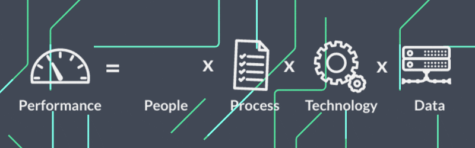

<!-- Header -->
<div align="center">



<br/>

```
// full-stack developer
```

# Bonjour, je suis **Ismaël Sacko** 👋

[](https://git.io/typing-svg)

</div>

<br/>

> 💡 Développeur full-stack junior spécialisé en **Java & Angular**, passionné par le logiciel, l'IA et les systèmes embarqués. Curieux, collaboratif, et toujours en apprentissage.

<br/>

---

## 🛠️ Stack & Outils

<details>
 <summary><strong>Languages :</strong></summary> <br>
 
 [](https://skillicons.dev)
</details>
<br />


<details>
 <summary><strong>Frameworks :</strong></summary> <br>
 
 [](https://skillicons.dev)
</details>
<br />


<details>
 <summary><strong>Bases de données  :</strong></summary> <br>
 
 [](https://skillicons.dev)
</details>
<br />


<details>
 <summary><strong>Outils :</strong></summary> <br>
 
 [](https://skillicons.dev)
</details>
<br />


<details>
 <summary><strong>Logiciels :</strong></summary> <br>
 
 [](https://skillicons.dev)
</details>
<br />

---

## 📊 GitHub Stats

<div align="center">


&nbsp;


</div>

<div align="center">


</div>

<br/>

---

## 📬 Me contacter

<div align="center">

[](https://linkedin.com/in/TON-PROFIL)
[](mailto:TON@EMAIL.com)
[](https://github.com/IsmaelSacko-py)

</div>

<br/>

---

<div align="center">
<sub><code>// BUILT WITH PASSION — ISMAËL SACKO</code></sub>
</div>
